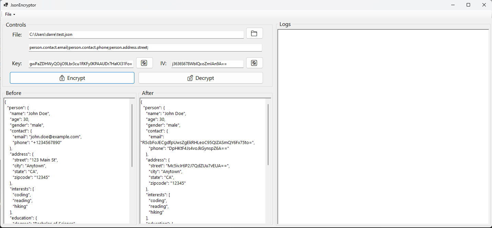

# JsonEncryptor
An easy-to-use tool for encrypting specific elements within a JSON file using AES encryption. The inspiration for this project stemmed from various situations where storing sensitive information in raw form within app settings or environment variables wasn't ideal, and access to dedicated secrets stores wasn't available.



## Features
- Load your JSON file
- Use your own AES Key and Iv (or generate a new pair)
- Select which value(s) to encrypt/decrypt by stating the key(s)
- Load your JSON file and compare before and after
- Save the UI state on a separate JSON file so that you can come back to where you left off

## Usage

### Option 1: Running Locally

1. Clone the repository:

    ```bash
    git clone https://github.com/your-username/your-repository.git
    ```

2. Navigate to the project directory:

    ```bash
    cd your-repository
    ```

3. Build the project:

    ```bash
    dotnet build
    ```

4. Run the application:

    ```bash
    dotnet run
    ```

### Option 2: Downloading Artifacts from Workflows

1. Go to the "Actions" tab on GitHub.

2. Select the workflow named "Build, Test, and Publish".

3. Click on the latest workflow run.

4. Navigate to the "Artifacts" section and download the artifacts named "WinForm".

5. Extract the downloaded artifacts.

6. Run the application executable.

## License
This project is licensed under the [MIT License](LICENSE).
